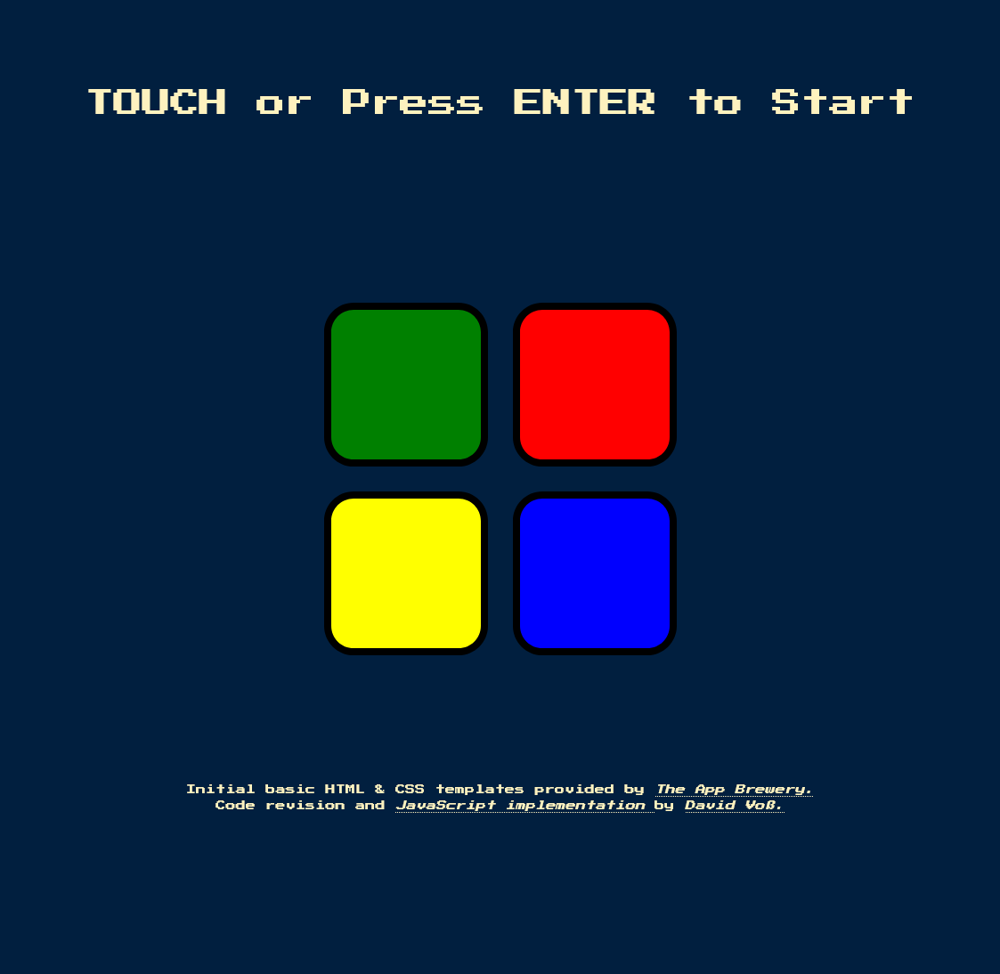
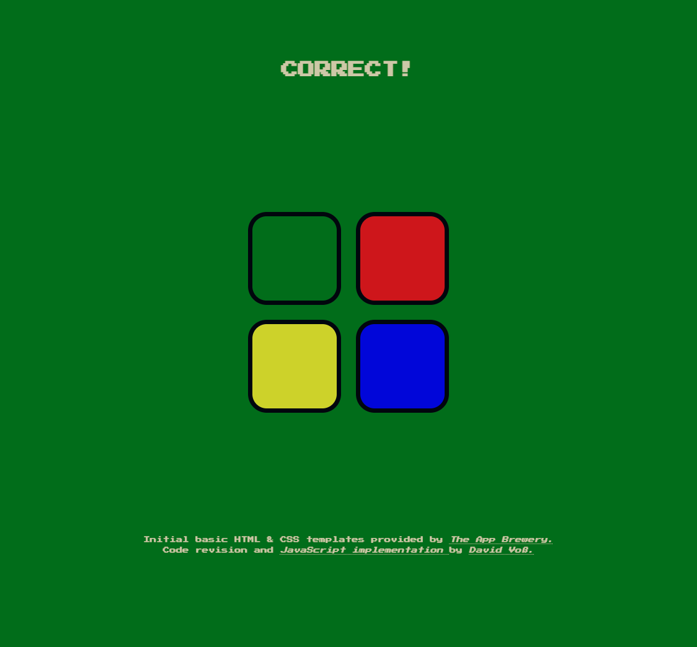
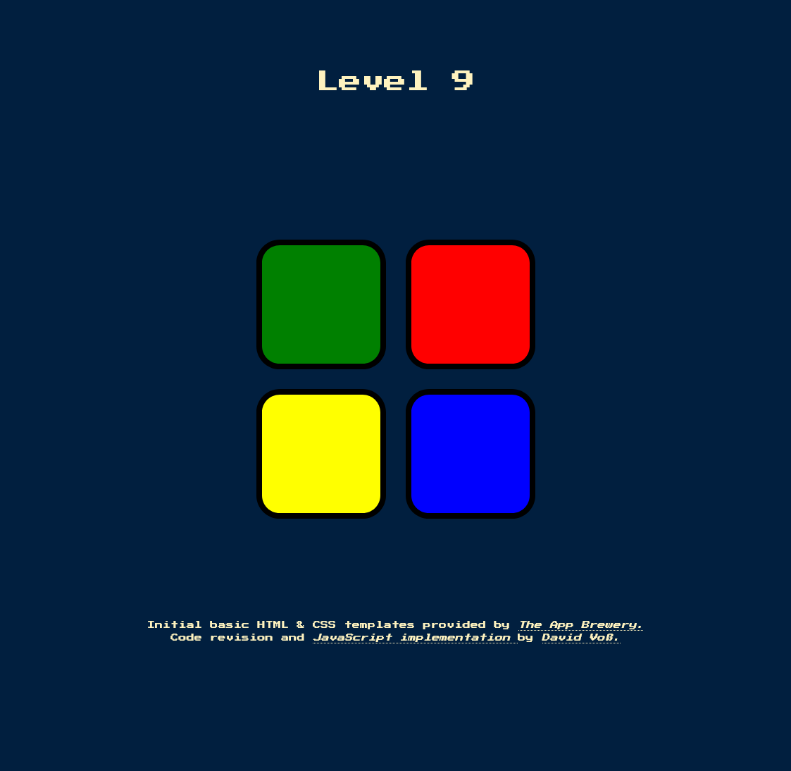
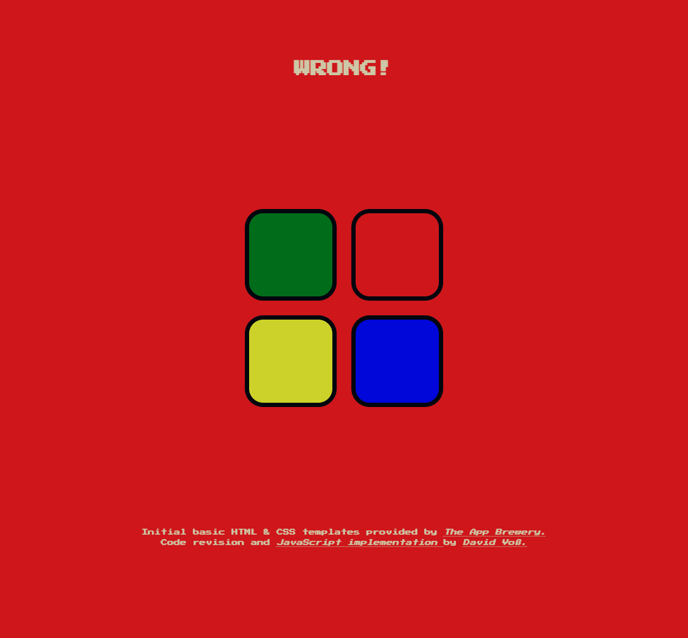
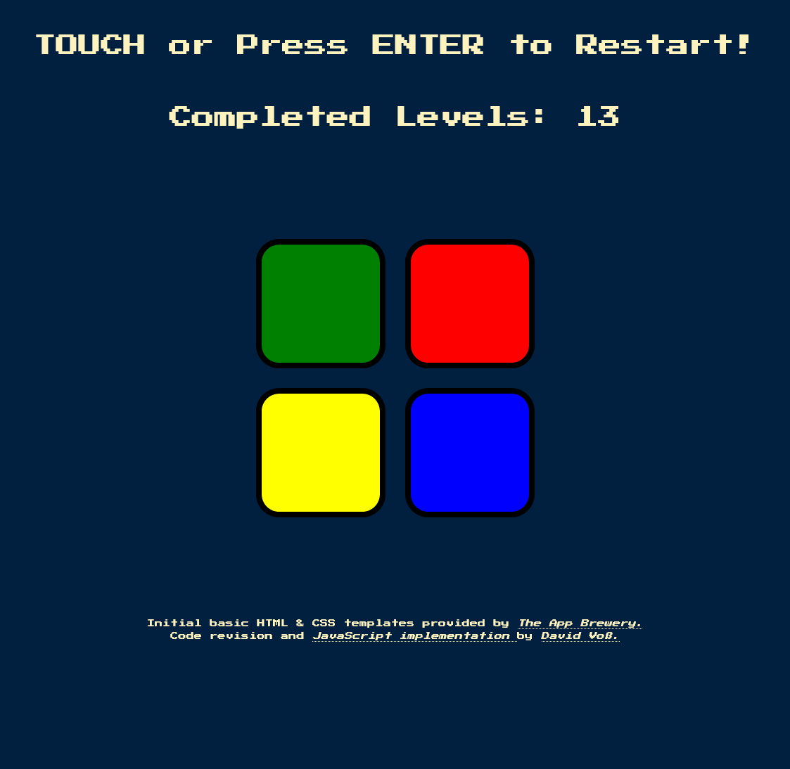

# 🎮 Simon Game

A browser-based Simon game implemented with modern ES-class structure, supporting keyboard, mouse and touch input.  
Players must memorise and reproduce an ever-growing sequence of coloured button presses to advance through the levels.

---
This project was created as a practice exercise to consolidate my JavaScript (and especially jQuery) skills from  
[_Dr. Angela Yu’s_](https://www.udemy.com/course/the-complete-web-development-bootcamp/) Udemy course  
**“The Complete Full-Stack Web Development Bootcamp”**.

I extended the original spec by:

- Applying an **OOP-style architecture**, including ES private class methods  
- Adding **responsive design** via media queries  
- Implementing extra **visual feedback**, e.g. for correct sequences   

---

> **🔗 Live Demo on GitHub Pages:**  
> 👉 [Simon Game on GitHub Pages](https://david-voss.github.io/Simon-Game/)

---

## 📋 Table of Contents

1. 🌄 [Preview](#1-preview)  
2. ⭐ [Features](#2-features)  
3. 🌐 [Technologies Used](#3-technologies-used)  
4. 🎮 [Controls](#4-controls)  
5. 📋 [Code Overview](#5-code-overview)  
6. 📐 [JavaScript Function Overview](#6-javascript-function-overview)  
7. ©️ [Author & Credits](#7-author--credits)  

---

## 1. 🌄 Preview

**Starting Screen:**

**Correct Sequence Feedback:**

**Sequence Progress:**

**Incorrect Sequence Feedback:**

**Game Over Screen:**

---

## 2. ⭐ Features

- **4-colour Simon game** with increasing random sequences  
- **Keyboard start/restart** (`ENTER`) and **click/touch** interactions  
- **Responsive layout**: optimised for use on desktop, tablets and smartphones  
- **Audio + visual feedback** for button presses, success and failure  
- **ES-class architecture** with private methods & utility module  

---

## 3. 🌐 Technologies Used

- HTML5  
- CSS3 (Flexbox & CSS Grid, Media Queries)  
- JavaScript (ES2022 classes, modules)  
- jQuery (for concise DOM handling & animations)  
- Google Fonts: *Press Start 2P*  

---

## 4. 🎮 Controls

| Action                     | Behaviour                                |
|----------------------------|------------------------------------------|
| **Press ENTER**            | Start or restart the game                |
| **Click / Touch** on colour button | Play that button, record player input |

---

## 5. 📋 Code Overview

The JS code is organised into three logical modules:

- **`index.js`**  
  Entry point – instantiates `SimonGame` and calls `initGame()`

- **`simon-game.js`**  
  `SimonGame` class – manages game state, level progression, input handling

- **`game-button.js`**  
  `GameButton` class – wraps each button’s DOM reference, sound and animations

- **`game-utils.js`**  
  `GameUtils` static class – timing, DOM/text helpers, feedback display

---

## 6. 📐 JavaScript Function Overview

| Function / Method                                      | Defined In          | Purpose                                                                 |
|--------------------------------------------------------|---------------------|-------------------------------------------------------------------------|
| `new SimonGame()`                                      | `simon-game.js`     | Instantiates the game and sets up initial state                         |
| `SimonGame.initGame()`                                 | `simon-game.js`     | Entry point: registers all event listeners                              |
| `#setUpInitialGameValues()`                            | `simon-game.js`     | Calls button and variable initialisers                                  |
| `#initClassVariables()`                                | `simon-game.js`     | Sets `currentLevel`, sequences and lock flags                           |
| `#initGameButtons()`                                   | `simon-game.js`     | Creates `GameButton` instances for each colour                          |
| `#initEventListeners()`                                | `simon-game.js`     | Binds key, touch and click listeners                                    |
| `#initKeyListener()`                                   | `simon-game.js`     | Listens for **Enter** key to start/restart                              |
| `#initTouchListener()`                                 | `simon-game.js`     | Listens for **touchstart** events to start/restart                      |
| `#initClickListener()`                                 | `simon-game.js`     | Attaches click handlers to every `.btn`                                  |
| `#startGameIfHasNotBeenStarted()`                      | `simon-game.js`     | Clears pending timeout and calls `#nextSequence()` if at level 0         |
| `#handlePlayerClick(btn)`                              | `simon-game.js`     | Processes a button press, locks input and records player sequence       |
| `#compareSelections()`                                 | `simon-game.js`     | Compares player input to random sequence; triggers success or reset      |
| `#nextSequence()`                                      | `simon-game.js`     | Increments level, updates heading and flashes next random button        |
| `#selectRandomButton()`                                | `simon-game.js`     | Chooses a random `GameButton` and appends to `randomSequence`           |
| `#resetGame()`                                         | `simon-game.js`     | Handles game-over feedback, resets state, schedules restart message     |
| `#resetGameState()`                                    | `simon-game.js`     | Clears level and both sequences                                         |
| `new GameButton(color)`                                | `game-button.js`    | Initialises button DOM reference, ID and audio                          |
| `GameButton.setButtonColor(newColor)`                  | `game-button.js`    | Reinitialises the button with a new colour                              |
| `GameButton.getButtonColor()`                          | `game-button.js`    | Returns the button’s colour                                             |
| `GameButton.getDomReference()`                         | `game-button.js`    | Returns the jQuery element reference                                    |
| `GameButton.getHtmlId()`                               | `game-button.js`    | Returns the element’s ID                                                |
| `GameButton.getAudioSrc()`                             | `game-button.js`    | Returns the path to the audio file                                      |
| `GameButton.playerButtonInteraction()`                 | `game-button.js`    | Triggers both animation and pressed-feedback                            |
| `GameButton.buttonAnimation()`                         | `game-button.js`    | Plays sound and flash animation                                          |
| `GameButton.playButtonSound()`                         | `game-button.js`    | Plays the configured audio                                              |
| `GameButton.buttonActivationFlash()`                   | `game-button.js`    | Fades the button out/in to flash                                        |
| `GameButton.pressedByPlayerAnimation()`                | `game-button.js`    | Applies temporary `pressed` class for visual feedback                   |
| `GameUtils.randomNumber(multiplier)`                   | `game-utils.js`     | Returns a random integer from 0 to multiplier − 1                       |
| `GameUtils.timeOut(fn, ms, ...args)`                   | `game-utils.js`     | Wrapper around `setTimeout`, returns the timeout ID                     |
| `GameUtils.changeText(selector, text)`                 | `game-utils.js`     | Sets `.text()` content on the given selector                            |
| `GameUtils.changeHtml(selector, html)`                 | `game-utils.js`     | Sets `.html()` content on the given selector                            |
| `GameUtils.showFeedback(src, msg, cssClass)`           | `game-utils.js`     | Plays sound and displays styled message                                 |
| `GameUtils.feedbackSound(src)`                         | `game-utils.js`     | Instantiates and plays an audio object                                  |
| `GameUtils.feedbackText(text, cssClass)`               | `game-utils.js`     | Adds/removes a CSS class and updates heading                            |
| `GameUtils.toggleClassDelayed(selector, cls, delay)`   | `game-utils.js`     | Adds a class, waits, then removes it                                    |

---

## 7. ©️ Author & Credits

- **Initial basic HTML & CSS** provided by <a 
          href="https://appbrewery.com/" 
          title="Visit The App Brewery" 
          target="_blank" 
          rel="noopener noreferrer">
          The App Brewery
        </a>.  
- **HTML & CSS enhancements** and **JavaScript implementation** by <a 
          href="https://github.com/David-Voss" 
          title="Visit David Voß’s GitHub profile" 
          target="_blank" 
          rel="noopener noreferrer">
          David Voß
        </a>. 

---
